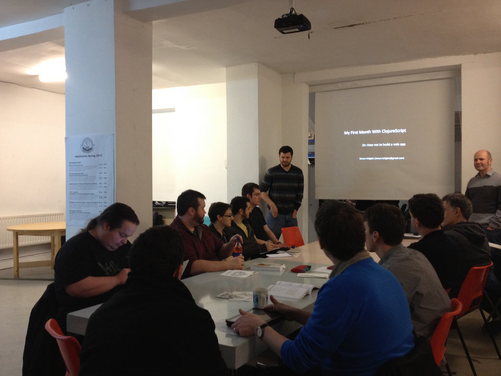

 <section id="jam_147" class="">
   

     

       <h2>About us</h2>
     

     

       The λ lounge meets monthly to talk about and popularise
       new ways of thinking about computation.&nbsp; Frequent
       topics include, <b>functional programming</b>, <b>type
       systems</b>, <b>programming language design</b> and
       aspects of <b>computer science</b>. 
        
       We are programming language agnostic, but have
       traditionally focused on exploring functional
       programming, though we are open to hosting more diverse
       talks on computer science topics. 
        
       We were born from the Manchester&nbsp;<a href=
       "http://manchester.clojuredojo.org/" target=
       "_self">Clojure Dojo</a>, when we decided there would be
       more demand for a broader group focusing on functional
       programming in general. &nbsp;We asked politely and took
       the name from the American revolutionaries, of the
       orignal&nbsp;<a href="http://lambdalounge.org/" target=
       "_self">Lambda Lounge</a>&nbsp;in St Louis. &nbsp;Our
       logo was designed by the incredibly
       talented&nbsp;<a href="https://twitter.com/#!/hltn"
       target="_self">@hltn</a>. 
     

     

       

         <figure>
           
         </figure>
       

       

         <a href=
         "https://twitter.com/#!/RickMoynihan">@RickMoynihan</a>&nbsp;introducing&nbsp;<a href="https://twitter.com/#!/SimonHolgate">@SimonHolgate</a>'s
         talk on&nbsp;<a href=
         "https://github.com/clojure/clojurescript">ClojureScript</a>&nbsp;at
         the first Manchester Lambda Lounge.&nbsp; 
       

     

   

 </section>
